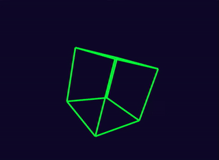

  

# 3D Cube Renderer

A simple 3D wireframe cube renderer built from scratch using HTML5 Canvas and vanilla JavaScript.  
Inspired by [Tsoding](https://www.youtube.com/watch?v=qjWkNZ0SXfo) on 3D rendering from scratch.

## Live Preview

[live](https://mzmahid.github.io/goriber_3d_engine)

## Features

- Real-time 3D rotation animation
- Perspective projection
- Custom transformation pipeline (rotation → projection → screen space)
- Pure canvas rendering, no external libraries

## How It Works

The renderer implements a basic 3D graphics pipeline:

1. **Rotation** – Rotates vertices around the Y-axis
2. **Projection** – Projects 3D coordinates onto 2D screen using perspective division
3. **Screen Mapping** – Converts normalized coordinates to canvas pixel space
4. **Rendering** – Draws edges between transformed vertices

## Transformation Pipeline

